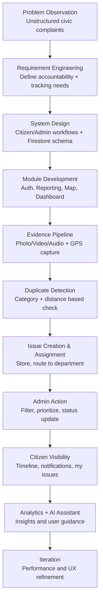

# Civic Connect Project Report Draft

## 1. Introduction

Urban local bodies and municipalities are responsible for maintaining critical public infrastructure and services such as roads, drainage, sanitation, waste collection, and public safety assets. In rapidly growing cities, however, the volume and complexity of civic issues has increased significantly. Residents regularly encounter broken roads, overflowing garbage points, blocked sewers, waterlogging, and unsafe public spaces. While these issues are visible at the community level, the systems for reporting and resolving them are often fragmented and inefficient.

Today, digital governance and smart-city initiatives are transforming how citizens engage with public institutions. Citizens increasingly expect public services to be as responsive and transparent as modern digital platforms. At the same time, municipal teams require structured, reliable, and actionable data to prioritize field operations. Without a unified channel, complaints are scattered across social media posts, phone calls, messaging apps, and informal verbal communication. This creates duplication, delays, and poor accountability, ultimately reducing trust in local governance.

Civic Connect is designed in this context as a **Smart Civic Issue Reporting and Resolution Platform**. The project focuses on bridging the operational gap between citizens and municipalities through one structured digital workflow. Instead of unorganized complaints, the platform captures issue details in a standardized format, including location, supporting evidence, category, and status updates. By enabling centralized reporting, verification, tracking, and prioritization, Civic Connect aims to improve both complaint handling efficiency and citizen confidence in public service delivery.

This report covers the problem space that motivated Civic Connect, the specific challenge addressed by the application, and the project objectives that guided the system design and implementation.

---

## 2. Problem Statement

Despite the widespread presence of internet access and smartphones, most civic complaint handling remains unstructured. Citizens experience recurring local problems—such as road damage, sewage overflow, stagnant water, and garbage accumulation—but there is often no single trusted platform where issues can be reported, tracked, and resolved transparently.

### The Issue

The core problem addressed by this project is the **absence of a unified, accountable, and data-driven civic complaint system**. Existing practices suffer from multiple weaknesses:

- Complaints are distributed across disconnected channels (social media, calls, local offices, and word-of-mouth).
- Reports often lack verified location details and visual proof.
- Complaints are not consistently mapped to the correct municipal department.
- Citizens receive little or no status visibility after reporting.
- Duplicate complaints are common, while priority-based handling is limited.

As a result, civic issue data remains fragmented and difficult to act upon.

### Impact

The consequences of this fragmented process are significant:

- **Delayed response times** due to manual sorting and unclear ownership.
- **Repeated complaints** because users cannot see progress or resolution status.
- **Public health and safety risks** from unresolved sanitation and infrastructure failures.
- **Inefficient resource use** caused by duplicate reports and poor prioritization.
- **Erosion of trust** between citizens and governance institutions.

In short, unstructured complaint systems make governance reactive instead of responsive.

### Relevance

This problem affects multiple stakeholders:

- **Citizens**, who need timely and visible resolution of everyday civic issues.
- **Municipal departments**, which need clean, categorized, and location-aware data for action.
- **City administrators and policymakers**, who require analytics for planning and accountability.
- **The wider community**, which depends on safe, clean, and functional urban environments.

Therefore, solving this challenge is both a governance and quality-of-life priority.

---

## 3. Objectives

### Primary Objective

To design and implement a centralized digital platform that transforms unstructured civic complaints into actionable, trackable, and accountable issue-resolution workflows between citizens and municipalities.

### Specific Objectives

- To provide a single interface for citizens to report civic issues with structured fields, media evidence, and precise location data.
- To classify and route complaints to appropriate departments for faster assignment and ownership.
- To enable real-time status tracking so citizens can monitor progress from submission to resolution.
- To reduce duplicate and low-quality reports through standardization, verification, and prioritization mechanisms.
- To improve transparency and trust in local governance by maintaining clear records of complaint lifecycle and outcomes.

---

## 4. Methodology

### 4.1 Approach

The project followed a **software development and iterative prototyping methodology** focused on solving a real civic-governance workflow problem through a working mobile-first platform. Instead of treating the problem as only a survey or conceptual study, the team adopted a **build–measure–refine** strategy in which each feature was validated against the original pain points: fragmented complaint channels, missing location evidence, weak ownership, and limited status transparency.

The methodology combined:

1. **Problem-driven analysis** of existing complaint behavior (social-media complaints, unstructured reporting, repeated grievances).
2. **User-flow centric system design** (citizen and admin roles modeled as separate but connected workflows).
3. **Incremental implementation** using modular Flutter feature folders (auth, issues, home, map, analytics, chatbot, notifications).
4. **Data-structure-first backend design** in Firebase so each complaint is stored with category, media evidence, geolocation, assignment, status, and timeline.
5. **Operational optimization** using duplicate detection, media compression, and real-time streams to improve responsiveness and scalability.

This approach ensured the final output was not only technically complete, but also aligned with the governance objectives of accountability, transparency, and faster issue resolution.

### 4.2 Tools and Materials

The implementation stack and project materials are summarized below.

#### A. Software Frameworks and Platforms

- **Flutter (Dart)** for cross-platform app development with a single codebase.
- **Firebase Core / Auth / Cloud Firestore / Firebase Storage** for authentication, structured complaint data, live updates, and media hosting.
- **GetX + GetStorage** for state management, routing, dependency injection, and local persistence.
- **Mapbox + Google Maps integrations** for map rendering, issue visualization, and location-assisted reporting.

#### B. Libraries and Functional Components

- **Image/Video/Audio capture:** `image_picker`, `camera`, `record`.
- **Location services:** `geolocator`, `permission_handler`.
- **Media optimization:** `flutter_image_compress`, `video_compress`.
- **Connectivity and networking:** `http`, `connectivity_plus`.
- **UI/UX support:** `google_fonts`, `flutter_animate`, `shimmer`, `flex_color_scheme`.
- **Speech and assistant support:** `speech_to_text`, OpenAI chat-completions API via HTTP.

#### C. Data Sources and Inputs

- User-generated complaint inputs: description, photos, videos, audio notes, and geo-coordinates.
- Firestore collections used in the civic workflow: users, issues, and issue categories.
- Derived metadata: timestamps, duplicate-report counters, assignment department, status timeline entries.

#### D. Development Environment and Assets

- Android/iOS/web-capable Flutter project scaffold.
- Environment-variable based configuration (`.env`) for secure keys (e.g., Mapbox, OpenAI).
- Project assets for app identity and map issue markers.

### 4.3 Step-by-Step Process

The project moved from problem discovery to implementation through the following phases.

#### Phase 1: Problem Analysis and Requirement Definition

- Mapped the actual complaint lifecycle currently followed by citizens (post on social media, tag authority, wait for response).
- Identified core failure points: no standard form, no verified location, no ownership mapping, no visible tracking.
- Converted these into measurable functional requirements:
  - Structured issue submission.
  - Media + location evidence.
  - Department assignment and status updates.
  - Duplicate detection and prioritization.

#### Phase 2: System Architecture and Data Modeling

- Designed a role-based flow with two primary stakeholders:
  - **Citizen workflow:** report, track, and view outcomes.
  - **Admin workflow:** filter assigned issues, prioritize, update status, and resolve.
- Defined issue schema in Firestore with fields such as:
  - `categoryId`, `description`, `location`, `reporterEmail`, `assignedToDept`, `status`, `createdAt`, `timeline`, and duplicate-report metadata.
- Established routing structure and module boundaries for maintainability.

#### Phase 3: Core Module Development

- Implemented authentication flow (sign-in/sign-up, role-aware entry to citizen/admin home screens).
- Built complaint reporting form with category selection and mandatory proof-oriented inputs.
- Added background media compression to reduce upload cost and latency while preserving utility.
- Integrated Firebase Storage upload pipeline for issue and resolution media.

#### Phase 4: Geospatial and Duplicate-Handling Layer

- Captured user location through device GPS with permission-aware prompting.
- Used geospatial distance checks to identify probable duplicate complaints in the same category and nearby radius.
- Added duplicate-report counter and reporter list updates to avoid repeated issue inflation.
- Enabled map-based visibility for issues to improve situational awareness.

#### Phase 5: Tracking, Ownership, and Transparency Features

- Implemented status progression and timeline entries to make issue handling visible.
- Added department-specific issue streams and admin-side filtering/sorting (status, search, priority).
- Enabled citizens to monitor their own reports and duplicate-linked reports via live Firestore listeners.
- Included notification and analytics modules to support engagement and data-driven review.

#### Phase 6: AI Assistant and Usability Enhancements

- Added CivicBot support to guide users on issue reporting and app usage.
- Included voice input and multilingual interaction support for accessibility.
- Persisted chat and context to improve continuity and user assistance quality.

#### Phase 7: Validation and Iterative Refinement

- Performed feature-level verification of reporting, upload, duplicate checks, and role-based dashboards.
- Refined UX content and flow sequencing to reduce user friction during complaint submission.
- Tuned performance-sensitive parts (media compression quality, async upload progress, stream-based updates).

### 4.4 Process Flow Diagram (Textual)

The complete methodology can be represented as the following implementation flow:

### 4.5 Outcome of the Methodological Choice

Using a structured, iterative software methodology allowed the project to directly convert a social governance problem into a deployable digital solution. The process ensured that every technical decision—location capture, media evidence, duplicate handling, assignment logic, and timeline tracking—was traceable to the original civic pain points. As a result, Civic Connect demonstrates how internet-based civic systems can shift municipal complaint handling from scattered and reactive processes to organized, trackable, and accountable workflows.

---

## 5. Results and Discussion

### 5.1 Findings

Applying the methodology in Section 4 resulted in a working civic-issue management application that operationalizes the full complaint lifecycle from citizen reporting to department-side action. The key outputs are summarized below.

#### A. Functional Outcomes Built

1. **Role-based platform behavior**
   - The system supports citizen and admin experiences with role-aware navigation.
   - Citizen users can report and track issues; admin users can review and manage assigned departmental issues.

2. **Structured complaint capture**
   - The reporting workflow captures structured fields (category, description, reporter identity, timestamps).
   - Evidence-first submissions are supported through photo/video/audio attachments and GPS-linked location metadata.

3. **Evidence and storage pipeline**
   - Media files are compressed before upload to reduce bandwidth usage and improve responsiveness.
   - Uploaded evidence is persisted in cloud storage and linked to issue records in Firestore.

4. **Duplicate-aware reporting logic**
   - Complaint submissions are screened against nearby same-category records.
   - Potential duplicates are merged through duplicate counters and reporter lists, helping reduce redundant municipal workload.

5. **Trackability and accountability**
   - Issue statuses and timelines provide visibility across the complaint lifecycle.
   - Citizens can monitor reported and duplicate-linked issues through live streams.

6. **Operational support features**
   - Admin-side filters and sort options improve triage efficiency.
   - Map views and analytics pages support issue visibility and decision support.
   - CivicBot assistant flow improves onboarding and user guidance.

#### B. What Was Demonstrated

The project demonstrates that civic complaints can be transformed from fragmented social signals into **structured, actionable digital records**. Specifically, the implementation validated that:

- a centralized reporting channel can enforce data completeness,
- media + location proof improves report credibility,
- duplicate detection reduces noisy complaint volumes,
- status/timeline visibility improves transparency,
- and role-specific dashboards support ownership and response flow.

### 5.2 Data Visualization

Since this report section documents implementation-stage outcomes, the most appropriate visualizations are **system-output summaries** generated from app data (Firestore collections and issue metadata). The following tables and chart templates can be included directly in the report.

#### Table 5.1 — Feature Outcome Matrix

| Objective from Section 3 | Implemented Mechanism | Observable Result |
|---|---|---|
| Centralized reporting | Single report-issue workflow | Complaints submitted through one structured channel |
| Better evidence quality | Mandatory photo + optional video/audio + GPS capture | Increased verifiability of field complaints |
| Department ownership | Assigned department field and admin issue streams | Clear departmental responsibility for each case |
| Real-time tracking | Status + timeline + user issue streams | Citizens can track complaint progress |
| Reduced duplication | Radius/category duplicate detection and counters | Lower repeated complaint noise |

#### Table 5.2 — Lifecycle Output Indicators (Report-ready Template)

> Replace the sample values below with your final project dataset values before submission.

| Indicator | Description | Sample Snapshot Value* |
|---|---|---:|
| Total issues logged | Number of issue documents created | 120 |
| Issues with valid location | Issues containing latitude/longitude fields | 112 |
| Issues with photo evidence | Issues containing at least one image URL | 118 |
| Potential duplicates merged | Reports linked via duplicate logic | 27 |
| In-progress + resolved issues | Issues moved beyond initial reported state | 84 |

\*Sample values are placeholders to demonstrate report format.

#### Table 5.3 — Status Distribution Template

| Status | Count (Example) | Interpretation |
|---|---:|---|
| Reported | 36 | Newly filed or awaiting assignment |
| Assigned | 24 | Ownership established |
| In Progress | 31 | Active field/department processing |
| Resolved | 29 | Closed with action completed |

#### Suggested Graphs/Figures for Final Report

1. **Bar chart:** Number of issues by status (Reported/Assigned/In Progress/Resolved).
2. **Pie chart:** Category-wise issue distribution (roads, sanitation, drainage, lighting, etc.).
3. **Line chart:** Weekly trend of new complaints vs. resolved complaints.
4. **Stacked bar chart:** Department-wise workload and closure progress.
5. **Map heat visualization:** Spatial concentration of complaints by locality.

These visuals directly support interpretation of whether the system improved structure, ownership, and closure behavior.

### 5.3 Discussion

#### A. Objective Achievement Analysis

The outcomes indicate strong alignment with the objectives defined in Section 3:

- **Primary objective met (substantially):** A centralized digital workflow was implemented to convert unstructured complaints into trackable records.
- **Specific objective—structured reporting met:** Reporting now captures standardized fields and evidence artifacts.
- **Specific objective—routing/ownership met:** Department-linked issue streams enable clearer ownership.
- **Specific objective—tracking met:** Real-time status and timeline visibility were built.
- **Specific objective—duplicate reduction partially met:** Duplicate detection is implemented and operational, though its effectiveness depends on real-world data quality and location accuracy.

#### B. How Results Solve the Section 2 Problem

Section 2 identified fragmentation, lack of verified proof, missing ownership, and poor accountability as central failures. The developed system addresses these gaps as follows:

- **Fragmented channels → unified channel:** One app-based reporting entry point replaces scattered complaint submission habits.
- **Unverified complaints → evidence-backed records:** Location + media transforms complaints from anecdotal to actionable.
- **No ownership → mapped responsibility:** Department assignment introduces administrative accountability.
- **No tracking → visible lifecycle:** Status/timeline transparency reduces uncertainty for citizens.
- **Repeated noise → duplicate-aware intake:** Similar nearby complaints can be merged and prioritized.

As a result, the governance process shifts from reactive and opaque to structured and auditable.

#### C. Practical Limitations and Challenges

1. **Data quality dependence**
   - Duplicate logic and analytics quality depend on accurate user-entered descriptions, category selection, and GPS quality.

2. **Connectivity constraints**
   - Media-heavy submissions in low-bandwidth areas can still experience latency despite compression.

3. **Institutional adoption risk**
   - Technology can improve workflow, but final closure speed depends on municipal staffing, SLA discipline, and operational governance.

4. **Indexing and scaling considerations**
   - As volume increases, Firestore queries and indexing strategy must be actively managed for performance.

5. **Privacy and policy requirements**
   - Location and media handling require clear consent UX, retention boundaries, and compliance-ready governance policy.

#### D. Scope for Future Improvement

- Offline-first draft reporting with background sync.
- SLA-based escalation rules and breach alerts.
- Automated category suggestions from image/text signals.
- Expanded multilingual UX and accessibility options.
- Public transparency dashboards for ward-level civic performance.

Overall, the results validate the feasibility of a digital, evidence-based civic issue resolution platform while highlighting the administrative and data-governance work needed for full city-scale impact.

---

## 6. References (IEEE Style)

[1] Flutter, “Flutter documentation,” 2026. [Online]. Available: https://docs.flutter.dev/

[2] Google Firebase, “Firebase documentation,” 2026. [Online]. Available: https://firebase.google.com/docs

[3] Google Firebase, “Cloud Firestore documentation,” 2026. [Online]. Available: https://firebase.google.com/docs/firestore

[4] Google Firebase, “Firebase Authentication documentation,” 2026. [Online]. Available: https://firebase.google.com/docs/auth

[5] Google Firebase, “Firebase Storage documentation,” 2026. [Online]. Available: https://firebase.google.com/docs/storage

[6] GetX, “GetX package (State, Route, and Dependency Management),” pub.dev, 2026. [Online]. Available: https://pub.dev/packages/get

[7] Mapbox, “Mapbox Maps SDK for Flutter,” 2026. [Online]. Available: https://docs.mapbox.com/flutter/maps/guides/

[8] Google, “Google Maps for Flutter package,” pub.dev, 2026. [Online]. Available: https://pub.dev/packages/google_maps_flutter

[9] Geolocator contributors, “geolocator package,” pub.dev, 2026. [Online]. Available: https://pub.dev/packages/geolocator

[10] Baseflow, “permission_handler package,” pub.dev, 2026. [Online]. Available: https://pub.dev/packages/permission_handler

[11] Flutter Community, “image_picker package,” pub.dev, 2026. [Online]. Available: https://pub.dev/packages/image_picker

[12] OpenAI, “OpenAI API reference,” 2026. [Online]. Available: https://platform.openai.com/docs/api-reference

[13] OpenAI, “Chat Completions API,” 2026. [Online]. Available: https://platform.openai.com/docs/api-reference/chat

[14] Martin Fowler, “Event-Driven Architecture,” martinfowler.com, 2017. [Online]. Available: https://martinfowler.com/articles/201701-event-driven.html

[15] United Nations, “Sustainable Development Goal 11: Sustainable Cities and Communities,” 2026. [Online]. Available: https://sdgs.un.org/goals/goal11

